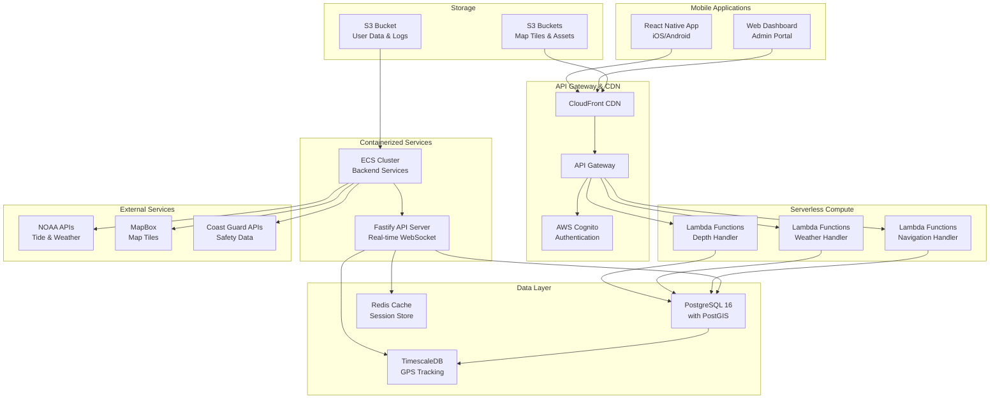
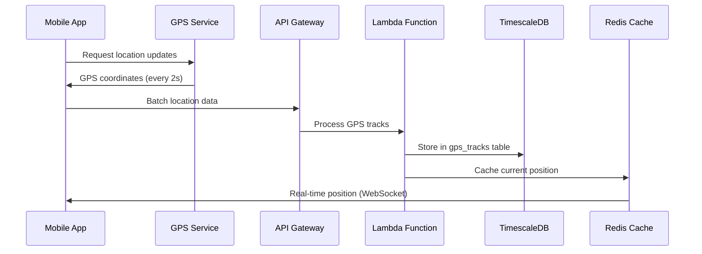
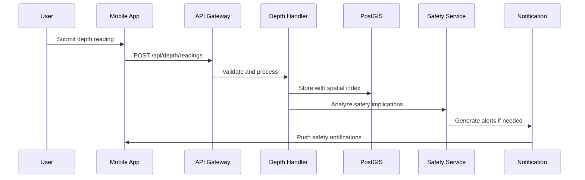
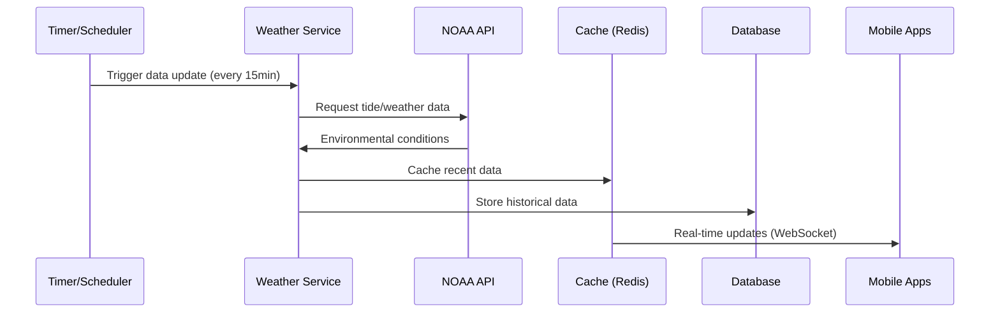

# System Architecture Overview

## Executive Summary

The Waves marine navigation platform is a cloud-native, mobile-first application designed to crowdsource depth data for safer nearshore navigation. The system combines real-time GPS tracking, environmental data integration, and machine learning to provide navigation guidance for recreational boaters.

## High-Level Architecture



## Core Components

### 1. Mobile Frontend (React Native)

**Primary Technology Stack:**
- React Native 0.72.6 with TypeScript
- Redux Toolkit for state management
- MapBox SDK for marine mapping
- Background location services
- Offline-first data synchronization

**Key Features:**
- Cross-platform iOS/Android support
- Real-time GPS tracking with battery optimization
- Offline capability for critical navigation data
- 3D underwater terrain visualization
- Safety alert system with grounding prevention

**Architecture Patterns:**
```typescript
// State management structure
store/
├── api/wavesApi.ts          // RTK Query API definitions
├── slices/
│   ├── locationSlice.ts     // GPS and positioning
│   ├── depthSlice.ts        // Depth readings and safety
│   ├── mapSlice.ts          // Map state and overlays
│   └── navigationSlice.ts   // Route planning and guidance
└── index.ts                 // Store configuration
```

### 2. Backend Services (Node.js 22)

**API Server Architecture:**
- Fastify framework for high-performance HTTP/WebSocket
- PostgreSQL with PostGIS for geospatial operations
- TimescaleDB for time-series GPS tracking data
- Redis for caching and real-time session management

**Service Organization:**
```typescript
// Backend service structure
src/
├── lambda/                  // AWS Lambda handlers
│   ├── depthHandler.ts     // Depth data processing
│   ├── weatherHandler.ts   // Weather and environmental data
│   └── navigationHandler.ts // Route calculation
├── services/               // Business logic
│   ├── depthService.ts     // Depth analysis and validation
│   ├── weatherService.ts   // NOAA integration
│   └── safetyService.ts    // Grounding prevention
└── routes/                 // Express/Fastify routes
    ├── auth.ts             // Authentication endpoints
    ├── depth.ts            // Depth data API
    └── navigation.ts       // Navigation services
```

### 3. Data Platform (PostgreSQL + PostGIS)

**Database Architecture:**
- PostgreSQL 16 with PostGIS extensions for spatial data
- TimescaleDB for efficient time-series storage
- Spatial indexing for high-performance geospatial queries
- Real-time data processing with streaming

**Schema Design:**
```sql
-- Core entities with spatial relationships
users               -- User accounts and preferences
vessels             -- Boat profiles with draft specifications
gps_tracks          -- TimescaleDB hypertable for GPS data
depth_readings      -- TimescaleDB hypertable for depth measurements
marine_areas        -- Spatial polygons for harbors, channels, etc.
weather_data        -- Cached environmental conditions
safety_alerts       -- Real-time safety notifications
```

## Data Flow Architecture

### 1. Real-Time GPS Tracking



### 2. Depth Data Processing



### 3. Environmental Data Integration



## Scalability Design

### Horizontal Scaling Patterns

**API Layer:**
- AWS Lambda for automatic scaling of depth/weather handlers
- ECS with Application Load Balancer for WebSocket connections
- API Gateway with throttling and caching

**Database Layer:**
- Read replicas for query distribution
- TimescaleDB partitioning for time-series data
- Connection pooling with pgBouncer

**Caching Strategy:**
- Redis cluster for session management
- CloudFront CDN for static assets and map tiles
- Application-level caching for frequently accessed data

### Performance Optimizations

**Geospatial Queries:**
```sql
-- Optimized depth reading queries with spatial indexing
CREATE INDEX CONCURRENTLY idx_depth_readings_location_time 
ON depth_readings USING GIST (location, timestamp);

-- Efficient nearest-neighbor searches
SELECT * FROM depth_readings 
WHERE ST_DWithin(location, ST_Point($1, $2)::geography, 1000)
ORDER BY location <-> ST_Point($1, $2)::geography
LIMIT 50;
```

**Mobile Optimization:**
- Offline-first architecture with local SQLite caching
- Incremental data synchronization
- Battery-optimized GPS tracking
- Progressive map tile loading

## Security Architecture

### Authentication & Authorization

**AWS Cognito Integration:**
- JWT tokens with refresh token rotation
- Multi-factor authentication for captain accounts
- Role-based access control (User, Captain, Admin)
- Device-specific session management

**API Security:**
```typescript
// Security middleware implementation
app.register(require('@fastify/jwt'), {
  secret: process.env.JWT_SECRET,
  sign: { expiresIn: '15m' }
});

app.register(require('@fastify/rate-limit'), {
  max: 100,
  timeWindow: '1 minute'
});
```

### Data Protection

**Privacy by Design:**
- GPS track anonymization and aggregation
- Configurable data sharing preferences
- GDPR-compliant data retention policies
- Encrypted data transmission (TLS 1.3)

**Maritime Safety Compliance:**
- Clear disclaimers for navigation data limitations
- Integration with official chart data sources
- Emergency contact system with Coast Guard APIs
- Audit logging for safety-critical operations

## Monitoring & Observability

### Application Monitoring

**CloudWatch Integration:**
- Custom metrics for marine-specific operations
- Log aggregation from all services
- Real-time alerting for system issues
- Performance monitoring with distributed tracing

**Key Metrics:**
```typescript
// Marine navigation metrics
const metrics = {
  depthDataAccuracy: 'Accuracy of crowd-sourced vs. official data',
  safetyAlertResponseTime: 'Time from alert to user acknowledgment',
  gpsTrackingAccuracy: 'Precision of location tracking',
  offlineDataSyncSuccess: 'Success rate of data synchronization',
  batteryOptimizationEffectiveness: 'Battery usage efficiency'
};
```

### Health Checks

**Service Health Monitoring:**
```typescript
// Health check endpoints
app.get('/health', async (request, reply) => {
  const checks = await Promise.allSettled([
    checkDatabase(),
    checkRedis(),
    checkNoaaApi(),
    checkMapboxApi()
  ]);
  
  return {
    status: 'healthy',
    timestamp: new Date().toISOString(),
    services: checks,
    version: process.env.APP_VERSION
  };
});
```

## Disaster Recovery

### Backup Strategy

**Database Backups:**
- Automated PostgreSQL backups with 30-day retention
- Point-in-time recovery capability
- Cross-region backup replication for production
- Regular backup restoration testing

**Data Redundancy:**
- Multi-AZ deployment for RDS instances
- S3 cross-region replication for critical assets
- Redis cluster with automatic failover
- Lambda function versioning and rollback capability

### Business Continuity

**Failover Procedures:**
1. Automated DNS failover for API endpoints
2. Read-only mode during database maintenance
3. Cached data serving during external API outages
4. Graceful degradation of non-critical features

## Technology Decisions & Rationale

### Why React Native?
- **Cross-platform efficiency**: Single codebase for iOS/Android
- **Performance**: Native module integration for GPS and mapping
- **Community**: Large ecosystem for marine-specific libraries
- **Maintainability**: Shared code with web dashboard components

### Why PostgreSQL + PostGIS?
- **Geospatial capabilities**: Advanced spatial queries and indexing
- **ACID compliance**: Critical for safety-related data
- **Performance**: Excellent performance for complex spatial operations
- **Ecosystem**: Rich tooling and extension ecosystem

### Why AWS Lambda + ECS Hybrid?
- **Cost efficiency**: Lambda for sporadic API requests
- **Real-time capability**: ECS for persistent WebSocket connections
- **Scalability**: Automatic scaling based on demand
- **Operational simplicity**: Managed services reduce operational overhead

## Future Architecture Considerations

### Planned Enhancements

**Machine Learning Integration:**
- TensorFlow.js for client-side depth prediction
- Real-time model training from crowdsourced data
- Anomaly detection for GPS tracking accuracy
- Predictive safety alerts based on weather patterns

**International Expansion:**
- Multi-region deployment architecture
- Localization support for different maritime regulations
- Integration with international weather services
- Currency and unit system adaptations

**IoT Device Integration:**
- Direct integration with marine electronics
- Automatic depth sounder data ingestion
- Weather station data collection
- Chart plotter integration protocols

This architecture provides a solid foundation for safe, scalable marine navigation while maintaining the flexibility to evolve with changing requirements and technologies.