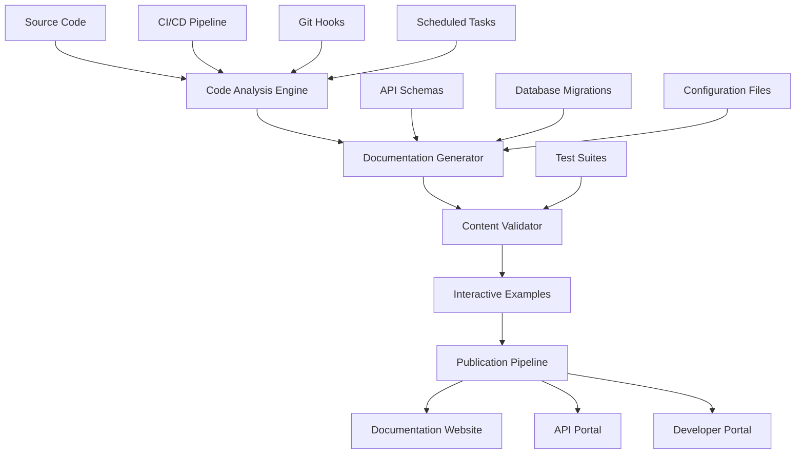

# Living Documentation System

## Overview

The Waves living documentation system automatically generates, updates, and validates documentation to ensure it stays current with the codebase. This system provides real-time synchronization between code and documentation, interactive examples, and comprehensive validation.

## System Architecture



## Documentation Generation Pipeline

### 1. Automated Code Analysis

**Code Scanner Configuration:**

```typescript
// Documentation generator configuration
interface DocumentationConfig {
  sources: {
    apiRoutes: string[];           // API endpoint definitions
    databaseSchemas: string[];     // Database migration files
    components: string[];          // React/React Native components
    services: string[];            // Business logic services
    types: string[];               // TypeScript type definitions
  };
  
  outputs: {
    apiDocs: string;              // Generated API documentation
    architectureDocs: string;     // System architecture docs
    userGuides: string;           // User documentation
    developerGuides: string;      // Developer guides
  };
  
  automation: {
    updateFrequency: 'on-commit' | 'hourly' | 'daily';
    validationLevel: 'strict' | 'standard' | 'permissive';
    interactiveExamples: boolean;
    screenshotGeneration: boolean;
  };
}

class DocumentationGenerator {
  private config: DocumentationConfig;
  
  async generateDocumentation(): Promise<GenerationResult> {
    const results = await Promise.all([
      this.generateAPIDocumentation(),
      this.generateArchitectureDocumentation(),
      this.generateUserDocumentation(),
      this.generateDeveloperDocumentation(),
      this.generateInteractiveExamples()
    ]);
    
    return {
      success: results.every(r => r.success),
      results,
      timestamp: new Date().toISOString(),
      metrics: this.calculateMetrics(results)
    };
  }
  
  private async generateAPIDocumentation(): Promise<DocGenerationResult> {
    // Extract API routes and generate OpenAPI specifications
    const apiRoutes = await this.extractAPIRoutes();
    const openAPISpec = await this.generateOpenAPISpec(apiRoutes);
    
    // Generate interactive API documentation
    const interactiveDocs = await this.generateInteractiveAPIDocs(openAPISpec);
    
    return {
      success: true,
      files: ['api/rest-api.md', 'api/interactive-examples.html'],
      metrics: {
        endpointsDocumented: apiRoutes.length,
        examplesGenerated: interactiveDocs.examples.length
      }
    };
  }
}
```

### 2. API Documentation Automation

**OpenAPI Schema Generation:**

```typescript
// Automatic OpenAPI schema generation from code
class OpenAPIGenerator {
  async extractAPISchema(): Promise<OpenAPISchema> {
    const routes = await this.scanRouteFiles([
      'backend/src/routes/*.ts',
      'backend/src/lambda/*.ts'
    ]);
    
    const schema: OpenAPISchema = {
      openapi: '3.0.0',
      info: {
        title: 'Waves Marine Navigation API',
        version: this.getVersionFromPackageJson(),
        description: 'Marine navigation and depth data API'
      },
      servers: [
        { url: 'https://api.wavesapp.com/v1', description: 'Production' },
        { url: 'https://staging-api.wavesapp.com/v1', description: 'Staging' },
        { url: 'http://localhost:8080/v1', description: 'Development' }
      ],
      paths: {},
      components: {
        schemas: await this.extractTypeDefinitions(),
        securitySchemes: this.getSecuritySchemes()
      }
    };
    
    // Generate paths from route analysis
    for (const route of routes) {
      schema.paths[route.path] = await this.generatePathDefinition(route);
    }
    
    return schema;
  }
  
  private async scanRouteFiles(patterns: string[]): Promise<RouteDefinition[]> {
    const routes: RouteDefinition[] = [];
    
    for (const pattern of patterns) {
      const files = await glob(pattern);
      
      for (const file of files) {
        const content = await fs.readFile(file, 'utf8');
        const ast = this.parseTypeScript(content);
        
        // Extract route definitions from AST
        const fileRoutes = await this.extractRoutesFromAST(ast, file);
        routes.push(...fileRoutes);
      }
    }
    
    return routes;
  }
  
  private async generatePathDefinition(route: RouteDefinition): Promise<PathItem> {
    return {
      [route.method.toLowerCase()]: {
        summary: route.summary,
        description: route.description,
        tags: route.tags,
        parameters: await this.extractParameters(route),
        requestBody: await this.extractRequestBody(route),
        responses: await this.extractResponses(route),
        security: route.requiresAuth ? [{ bearerAuth: [] }] : undefined
      }
    };
  }
}
```

### 3. Database Documentation Automation

**Schema Documentation Generator:**

```typescript
class DatabaseDocumentationGenerator {
  async generateDatabaseDocs(): Promise<DatabaseDocumentation> {
    const migrations = await this.loadMigrations();
    const currentSchema = await this.analyzeCurrentSchema();
    
    return {
      overview: this.generateSchemaOverview(currentSchema),
      tables: await this.generateTableDocumentation(currentSchema),
      relationships: await this.generateRelationshipDiagram(currentSchema),
      indexes: await this.generateIndexDocumentation(currentSchema),
      functions: await this.generateFunctionDocumentation(currentSchema),
      migrations: await this.generateMigrationHistory(migrations)
    };
  }
  
  private async generateTableDocumentation(schema: DatabaseSchema): Promise<TableDoc[]> {
    const tableDocs: TableDoc[] = [];
    
    for (const table of schema.tables) {
      const doc: TableDoc = {
        name: table.name,
        description: await this.extractTableDescription(table),
        columns: table.columns.map(col => ({
          name: col.name,
          type: col.dataType,
          nullable: col.isNullable,
          default: col.defaultValue,
          description: this.extractColumnDescription(col),
          constraints: col.constraints
        })),
        indexes: table.indexes.map(idx => ({
          name: idx.name,
          type: idx.type,
          columns: idx.columns,
          unique: idx.isUnique,
          description: this.extractIndexDescription(idx)
        })),
        foreignKeys: table.foreignKeys.map(fk => ({
          column: fk.column,
          references: {
            table: fk.referencedTable,
            column: fk.referencedColumn
          },
          onDelete: fk.onDelete,
          onUpdate: fk.onUpdate
        })),
        triggers: table.triggers,
        estimatedRows: await this.getTableRowCount(table.name),
        lastModified: await this.getTableLastModified(table.name)
      };
      
      tableDocs.push(doc);
    }
    
    return tableDocs;
  }
}
```

### 4. Component Documentation Automation

**React Component Documentation:**

```typescript
class ComponentDocumentationGenerator {
  async generateComponentDocs(): Promise<ComponentDocumentation> {
    const components = await this.scanComponents([
      'src/components/**/*.tsx',
      'src/screens/**/*.tsx'
    ]);
    
    const componentDocs: ComponentDoc[] = [];
    
    for (const component of components) {
      const doc = await this.analyzeComponent(component);
      componentDocs.push(doc);
    }
    
    return {
      components: componentDocs,
      storybook: await this.generateStorybookConfig(componentDocs),
      usage: await this.generateUsageExamples(componentDocs)
    };
  }
  
  private async analyzeComponent(componentPath: string): Promise<ComponentDoc> {
    const source = await fs.readFile(componentPath, 'utf8');
    const ast = this.parseTypeScript(source);
    
    return {
      name: this.extractComponentName(ast),
      description: this.extractComponentDescription(ast),
      props: await this.extractProps(ast),
      methods: await this.extractMethods(ast),
      examples: await this.extractExamples(componentPath),
      screenshots: await this.generateScreenshots(componentPath),
      dependencies: this.extractDependencies(ast),
      location: componentPath,
      lastModified: await this.getFileModificationDate(componentPath)
    };
  }
  
  private async generateScreenshots(componentPath: string): Promise<Screenshot[]> {
    // Automated screenshot generation using Puppeteer
    const screenshots: Screenshot[] = [];
    
    const browser = await puppeteer.launch();
    const page = await browser.newPage();
    
    // Generate screenshots for different screen sizes
    const viewports = [
      { width: 375, height: 667, name: 'iPhone SE' },
      { width: 414, height: 896, name: 'iPhone 11' },
      { width: 768, height: 1024, name: 'iPad' },
      { width: 1024, height: 768, name: 'iPad Landscape' }
    ];
    
    for (const viewport of viewports) {
      await page.setViewport(viewport);
      await page.goto(`http://localhost:3000/storybook?component=${componentPath}`);
      
      const screenshot = await page.screenshot({
        path: `docs/screenshots/${this.getComponentName(componentPath)}-${viewport.name}.png`,
        fullPage: true
      });
      
      screenshots.push({
        name: viewport.name,
        path: `screenshots/${this.getComponentName(componentPath)}-${viewport.name}.png`,
        dimensions: viewport
      });
    }
    
    await browser.close();
    return screenshots;
  }
}
```

## Documentation Validation System

### 1. Content Validation

**Automated Validation Pipeline:**

```typescript
class DocumentationValidator {
  private validationRules: ValidationRule[] = [
    new LinkValidationRule(),
    new CodeExampleValidationRule(),
    new ScreenshotValidationRule(),
    new APIConsistencyRule(),
    new MarineSafetyContentRule()
  ];
  
  async validateDocumentation(): Promise<ValidationReport> {
    const results: ValidationResult[] = [];
    
    for (const rule of this.validationRules) {
      const result = await rule.validate();
      results.push(result);
    }
    
    return {
      overall: results.every(r => r.passed),
      results,
      warnings: results.filter(r => r.warnings.length > 0),
      errors: results.filter(r => !r.passed),
      timestamp: new Date().toISOString()
    };
  }
}

class CodeExampleValidationRule implements ValidationRule {
  async validate(): Promise<ValidationResult> {
    const codeExamples = await this.extractCodeExamples();
    const results: TestResult[] = [];
    
    for (const example of codeExamples) {
      try {
        // Create temporary test file
        const testFile = await this.createTestFile(example);
        
        // Run the code example
        const result = await this.executeTest(testFile);
        
        results.push({
          example: example.id,
          passed: result.success,
          output: result.output,
          errors: result.errors
        });
        
        // Clean up
        await fs.unlink(testFile);
        
      } catch (error) {
        results.push({
          example: example.id,
          passed: false,
          errors: [error.message]
        });
      }
    }
    
    return {
      passed: results.every(r => r.passed),
      warnings: [],
      errors: results.filter(r => !r.passed).map(r => r.errors).flat(),
      details: results
    };
  }
}

class MarineSafetyContentRule implements ValidationRule {
  private requiredSafetyContent = [
    'navigation disclaimer',
    'official chart reference',
    'emergency procedures',
    'data limitations',
    'safety margin explanations'
  ];
  
  async validate(): Promise<ValidationResult> {
    const documentationFiles = await this.scanDocumentationFiles();
    const missingContent: string[] = [];
    
    for (const contentType of this.requiredSafetyContent) {
      const found = await this.searchForSafetyContent(documentationFiles, contentType);
      if (!found) {
        missingContent.push(contentType);
      }
    }
    
    return {
      passed: missingContent.length === 0,
      warnings: missingContent.map(content => `Missing required safety content: ${content}`),
      errors: [],
      details: { missingContent }
    };
  }
}
```

### 2. Real-Time Synchronization

**Git Hook Integration:**

```bash
#!/bin/bash
# .git/hooks/pre-commit
# Automatic documentation updates on commit

echo "Updating documentation..."

# Generate API documentation
npm run docs:generate:api

# Update database schema documentation  
npm run docs:generate:database

# Validate all documentation
npm run docs:validate

# Check if validation passed
if [ $? -ne 0 ]; then
    echo "Documentation validation failed. Please fix errors before committing."
    exit 1
fi

# Add updated documentation to commit
git add docs/

echo "Documentation updated and validated successfully."
```

**CI/CD Pipeline Integration:**

```yaml
# .github/workflows/documentation.yml
name: Documentation Pipeline

on:
  push:
    branches: [main, develop]
  pull_request:
    branches: [main]

jobs:
  generate-docs:
    runs-on: ubuntu-latest
    steps:
      - uses: actions/checkout@v3
      
      - name: Setup Node.js
        uses: actions/setup-node@v3
        with:
          node-version: '22'
          cache: 'npm'
      
      - name: Install dependencies
        run: npm ci
      
      - name: Generate documentation
        run: |
          npm run docs:generate:all
          npm run docs:validate
      
      - name: Generate screenshots
        run: npm run docs:screenshots
        
      - name: Deploy to documentation site
        if: github.ref == 'refs/heads/main'
        run: npm run docs:deploy
        env:
          DEPLOY_TOKEN: ${{ secrets.DOCS_DEPLOY_TOKEN }}
      
      - name: Create PR comment with documentation diff
        if: github.event_name == 'pull_request'
        uses: actions/github-script@v6
        with:
          script: |
            const fs = require('fs');
            const diff = fs.readFileSync('docs-diff.txt', 'utf8');
            
            github.rest.issues.createComment({
              issue_number: context.issue.number,
              owner: context.repo.owner,
              repo: context.repo.repo,
              body: `## Documentation Changes\n\n${diff}`
            });
```

## Interactive Documentation Features

### 1. Live API Explorer

**API Testing Interface:**

```typescript
class LiveAPIExplorer {
  private apiClient: APIClient;
  
  async generateInteractiveExamples(): Promise<InteractiveExample[]> {
    const endpoints = await this.getAPIEndpoints();
    const examples: InteractiveExample[] = [];
    
    for (const endpoint of endpoints) {
      const example = await this.createInteractiveExample(endpoint);
      examples.push(example);
    }
    
    return examples;
  }
  
  private async createInteractiveExample(endpoint: APIEndpoint): Promise<InteractiveExample> {
    return {
      id: `${endpoint.method}-${endpoint.path}`,
      title: endpoint.summary,
      description: endpoint.description,
      method: endpoint.method,
      path: endpoint.path,
      parameters: this.generateParameterInputs(endpoint.parameters),
      requestBody: this.generateRequestBodyInput(endpoint.requestBody),
      examples: await this.generateExampleData(endpoint),
      authentication: endpoint.requiresAuth,
      tryItButton: this.generateTryItButton(endpoint),
      responseDisplay: this.generateResponseDisplay(endpoint)
    };
  }
  
  private generateTryItButton(endpoint: APIEndpoint): TryItButton {
    return {
      action: async (parameters: any, body: any) => {
        try {
          const response = await this.apiClient.request({
            method: endpoint.method,
            path: endpoint.path,
            parameters,
            body
          });
          
          return {
            success: true,
            status: response.status,
            headers: response.headers,
            body: response.data
          };
        } catch (error) {
          return {
            success: false,
            error: error.message,
            status: error.status,
            body: error.response?.data
          };
        }
      }
    };
  }
}
```

### 2. Code Example Testing

**Automated Example Validation:**

```typescript
class CodeExampleTester {
  async testAllExamples(): Promise<TestReport> {
    const examples = await this.extractCodeExamples();
    const results: ExampleTestResult[] = [];
    
    for (const example of examples) {
      const result = await this.testExample(example);
      results.push(result);
    }
    
    return {
      totalExamples: examples.length,
      passed: results.filter(r => r.success).length,
      failed: results.filter(r => !r.success).length,
      results
    };
  }
  
  private async testExample(example: CodeExample): Promise<ExampleTestResult> {
    const testEnvironment = await this.setupTestEnvironment(example.language);
    
    try {
      // Create test file with the example code
      const testFile = await this.createTestFile(example);
      
      // Execute the example
      const execution = await testEnvironment.run(testFile);
      
      // Validate output if expected output is provided
      const validation = example.expectedOutput ? 
        await this.validateOutput(execution.output, example.expectedOutput) : 
        { valid: true };
      
      return {
        example: example.id,
        success: execution.success && validation.valid,
        output: execution.output,
        errors: execution.errors,
        executionTime: execution.duration,
        validation
      };
      
    } catch (error) {
      return {
        example: example.id,
        success: false,
        errors: [error.message],
        executionTime: 0
      };
    } finally {
      await testEnvironment.cleanup();
    }
  }
}
```

## Documentation Metrics and Analytics

### 1. Documentation Quality Metrics

**Quality Measurement:**

```typescript
interface DocumentationMetrics {
  coverage: {
    apiEndpoints: number;          // % of API endpoints documented
    components: number;            // % of components documented
    functions: number;             // % of functions documented
    types: number;                 // % of types documented
  };
  
  freshness: {
    averageAge: number;            // Average age of documentation in days
    outdatedPages: number;         // Number of pages not updated in 30 days
    lastUpdated: Date;             // Last global documentation update
  };
  
  quality: {
    exampleCoverage: number;       // % of endpoints with working examples
    linkValidation: number;        // % of links that are valid
    screenshotCurrency: number;    // % of screenshots that are current
    codeExampleValidity: number;   // % of code examples that execute
  };
  
  usage: {
    pageViews: Map<string, number>; // Page view statistics
    searchQueries: string[];        // Most common search terms
    feedbackScore: number;          // Average user feedback score
  };
}

class DocumentationAnalytics {
  async generateMetricsReport(): Promise<DocumentationMetrics> {
    const [coverage, freshness, quality, usage] = await Promise.all([
      this.calculateCoverage(),
      this.calculateFreshness(),
      this.calculateQuality(),
      this.getUsageMetrics()
    ]);
    
    return { coverage, freshness, quality, usage };
  }
  
  private async calculateCoverage(): Promise<CoverageMetrics> {
    const [apiCoverage, componentCoverage, functionCoverage, typeCoverage] = 
      await Promise.all([
        this.calculateAPICoverage(),
        this.calculateComponentCoverage(),
        this.calculateFunctionCoverage(),
        this.calculateTypeCoverage()
      ]);
    
    return {
      apiEndpoints: apiCoverage,
      components: componentCoverage,
      functions: functionCoverage,
      types: typeCoverage
    };
  }
}
```

### 2. User Feedback Integration

**Documentation Feedback System:**

```typescript
class DocumentationFeedback {
  async collectFeedback(): Promise<FeedbackReport> {
    return {
      ratings: await this.getPageRatings(),
      comments: await this.getFeedbackComments(),
      searchAnalytics: await this.getSearchAnalytics(),
      usagePatterns: await this.getUsagePatterns()
    };
  }
  
  async generateImprovementSuggestions(): Promise<ImprovementSuggestion[]> {
    const feedback = await this.collectFeedback();
    const metrics = await this.getDocumentationMetrics();
    
    const suggestions: ImprovementSuggestion[] = [];
    
    // Analyze low-rated pages
    const lowRatedPages = feedback.ratings.filter(r => r.rating < 3);
    for (const page of lowRatedPages) {
      suggestions.push({
        type: 'content_improvement',
        priority: 'high',
        page: page.path,
        issue: 'Low user rating',
        suggestion: await this.generateContentImprovement(page)
      });
    }
    
    // Analyze missing documentation
    const undocumentedAPIs = await this.findUndocumentedAPIs();
    for (const api of undocumentedAPIs) {
      suggestions.push({
        type: 'missing_documentation',
        priority: 'medium',
        item: api.path,
        suggestion: 'Add comprehensive API documentation with examples'
      });
    }
    
    return suggestions;
  }
}
```

## Deployment and Hosting

### 1. Documentation Website

**Static Site Generation:**

```typescript
class DocumentationSiteGenerator {
  async generateSite(): Promise<SiteGenerationResult> {
    const pages = await this.loadAllDocumentation();
    const site = await this.generateStaticSite(pages);
    
    return {
      pages: site.pages.length,
      assets: site.assets.length,
      buildTime: site.buildTime,
      outputPath: site.outputPath
    };
  }
  
  private async generateStaticSite(pages: DocumentationPage[]): Promise<StaticSite> {
    const startTime = Date.now();
    
    // Generate HTML pages
    const htmlPages = await Promise.all(
      pages.map(page => this.generateHTMLPage(page))
    );
    
    // Copy assets
    const assets = await this.copyAssets();
    
    // Generate search index
    const searchIndex = await this.generateSearchIndex(pages);
    
    // Generate sitemap
    const sitemap = await this.generateSitemap(htmlPages);
    
    return {
      pages: htmlPages,
      assets,
      searchIndex,
      sitemap,
      buildTime: Date.now() - startTime,
      outputPath: './dist/docs'
    };
  }
}
```

### 2. CDN and Performance

**Performance Optimization:**

```yaml
# CloudFormation template for documentation CDN
Resources:
  DocumentationBucket:
    Type: AWS::S3::Bucket
    Properties:
      BucketName: waves-documentation
      WebsiteConfiguration:
        IndexDocument: index.html
        ErrorDocument: 404.html
      
  DocumentationCloudFront:
    Type: AWS::CloudFront::Distribution
    Properties:
      DistributionConfig:
        Enabled: true
        DefaultRootObject: index.html
        Origins:
          - Id: S3Origin
            DomainName: !GetAtt DocumentationBucket.DomainName
            S3OriginConfig:
              OriginAccessIdentity: !Ref CloudFrontOriginAccessIdentity
        DefaultCacheBehavior:
          TargetOriginId: S3Origin
          ViewerProtocolPolicy: redirect-to-https
          CachePolicyId: 4135ea2d-6df8-44a3-9df3-4b5a84be39ad # Managed-CachingOptimized
          Compress: true
        CustomErrorResponses:
          - ErrorCode: 404
            ResponseCode: 404
            ResponsePagePath: /404.html
        ViewerCertificate:
          AcmCertificateArn: !Ref SSLCertificate
          SslSupportMethod: sni-only
```

This living documentation system ensures that the Waves platform documentation remains accurate, comprehensive, and useful for all stakeholders while minimizing manual maintenance overhead.