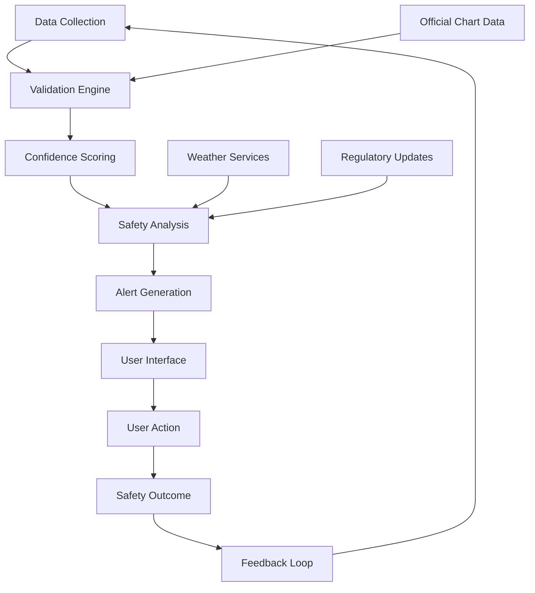
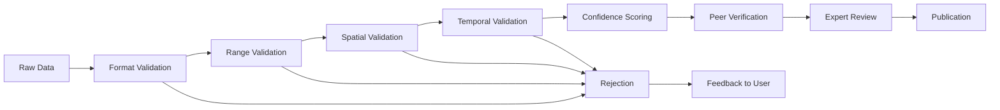

# Marine Navigation Safety Requirements

## Overview

The Waves marine navigation platform is designed with safety as the paramount concern. This document outlines the comprehensive safety requirements, compliance standards, and best practices that govern the development and operation of the platform.

## Safety Philosophy

### Core Principles

1. **Safety First**: Navigation safety takes precedence over all other considerations
2. **Transparency**: Clear disclosure of data limitations and uncertainties
3. **Redundancy**: Multiple data sources and validation mechanisms
4. **User Education**: Comprehensive safety education and warnings
5. **Regulatory Compliance**: Adherence to maritime safety regulations

### Risk Management Framework



## Navigation Safety Standards

### 1. Depth Data Accuracy Standards

**Accuracy Classifications:**
```typescript
enum DepthAccuracyClass {
  SURVEY_GRADE = 'survey_grade',      // ±0.1m accuracy
  NAVIGATION_GRADE = 'navigation',    // ±0.5m accuracy  
  REFERENCE_GRADE = 'reference',      // ±1.0m accuracy
  INDICATIVE = 'indicative'           // >±1.0m accuracy
}

interface DepthValidationCriteria {
  accuracy: DepthAccuracyClass;
  confidenceThreshold: number;        // 0.0 - 1.0
  verificationRequired: boolean;
  minimumDataPoints: number;
  temporalValidityDays: number;
  spatialValidityMeters: number;
}
```

**Validation Requirements:**
- All depth readings must include confidence scores
- Minimum 3 independent measurements for navigation-grade classification
- Maximum 30-day temporal validity without re-verification
- Spatial interpolation limited to 100m radius for safety-critical depths

### 2. Safety Margin Calculations

**Dynamic Safety Margins:**
```typescript
interface SafetyMarginCalculation {
  vesselDraft: number;                // Vessel draft in meters
  staticMargin: number;               // Base safety margin
  dynamicMargin: number;              // Weather/condition adjustments
  tideAllowance: number;              // Tide prediction uncertainty
  dataUncertainty: number;            // Depth data uncertainty
  totalMargin: number;                // Combined safety margin
}

function calculateSafetyMargin(
  vessel: VesselProfile,
  conditions: MarineConditions,
  depthData: DepthReading[]
): SafetyMarginCalculation {
  const baseMargin = Math.max(vessel.draft * 0.5, 1.0); // Minimum 1m or 50% of draft
  
  const conditionMultiplier = {
    seaState: Math.max(1.0, conditions.seaState * 0.1),
    visibility: conditions.visibility < 1000 ? 1.5 : 1.0,
    weather: conditions.weather === 'storm' ? 2.0 : 1.0
  };
  
  const dynamicMargin = baseMargin * 
    conditionMultiplier.seaState * 
    conditionMultiplier.visibility * 
    conditionMultiplier.weather;
  
  const dataUncertainty = calculateDataUncertainty(depthData);
  const tideUncertainty = estimateTideUncertainty(conditions.location);
  
  return {
    vesselDraft: vessel.draft,
    staticMargin: baseMargin,
    dynamicMargin,
    tideAllowance: tideUncertainty,
    dataUncertainty,
    totalMargin: dynamicMargin + tideUncertainty + dataUncertainty
  };
}
```

### 3. Grounding Prevention System

**Alert Hierarchy:**
```typescript
enum AlertSeverity {
  INFO = 'info',           // Informational notice
  CAUTION = 'caution',     // Increased attention required
  WARNING = 'warning',     // Immediate attention required  
  CRITICAL = 'critical',   // Urgent action required
  EMERGENCY = 'emergency'  // Immediate evasive action
}

interface GroundingAlert {
  severity: AlertSeverity;
  timeToImpact: number;           // Seconds until potential grounding
  depthBelow: number;             // Depth below vessel
  clearance: number;              // Water clearance under keel
  confidence: number;             // Alert confidence (0-1)
  recommendedAction: AvoidanceAction;
  alternativeActions: AvoidanceAction[];
}
```

**Alert Timing Thresholds:**
- **Emergency**: ≤30 seconds to impact, clearance ≤0.5m
- **Critical**: ≤2 minutes to impact, clearance ≤1.0m  
- **Warning**: ≤5 minutes to impact, clearance ≤2.0m
- **Caution**: ≤10 minutes to impact, clearance ≤vessel draft

### 4. Environmental Safety Considerations

**Weather Impact Assessment:**
```typescript
interface WeatherSafetyFactors {
  windSpeed: number;              // Knots
  waveHeight: number;             // Meters
  visibility: number;             // Meters
  seaState: number;               // 0-9 scale
  barometricTrend: 'rising' | 'falling' | 'steady';
  precipitationIntensity: number; // mm/hour
}

function assessWeatherSafety(
  conditions: WeatherSafetyFactors,
  vessel: VesselProfile
): SafetyAssessment {
  const riskFactors = {
    wind: conditions.windSpeed > vessel.maxSafeWindSpeed ? 'high' : 'low',
    waves: conditions.waveHeight > vessel.comfortableWaveHeight ? 'high' : 'low',
    visibility: conditions.visibility < 500 ? 'high' : 'low',
    seaState: conditions.seaState > 5 ? 'high' : 'moderate'
  };
  
  const overallRisk = calculateOverallRisk(riskFactors);
  
  return {
    riskLevel: overallRisk,
    limitations: generateLimitations(riskFactors),
    recommendations: generateRecommendations(riskFactors),
    validityPeriod: calculateValidityPeriod(conditions)
  };
}
```

## Data Quality Standards

### 1. Crowdsourced Data Validation

**Multi-Stage Validation Process:**



**Validation Criteria:**
```typescript
interface DataValidationRules {
  depth: {
    min: 0,
    max: 1000,                    // Maximum realistic depth for recreational boating
    resolution: 0.1              // Minimum measurable increment
  };
  coordinates: {
    latitudeRange: [-90, 90],
    longitudeRange: [-180, 180],
    precision: 6                 // Decimal places
  };
  temporal: {
    maxAge: 86400000,            // 24 hours in milliseconds
    futureTime: false            // No future timestamps
  };
  consistency: {
    maxDepthChange: 10,          // Max depth change per 100m distance
    minConfidence: 0.3,          // Minimum acceptable confidence
    vesselDraftLogical: true     // Depth must exceed vessel draft
  };
}
```

### 2. Confidence Scoring Algorithm

**Multi-Factor Confidence Calculation:**
```typescript
function calculateConfidenceScore(
  reading: DepthReading,
  context: ValidationContext
): number {
  const factors = {
    source: getSourceReliability(reading.source),           // 0.0-1.0
    equipment: getEquipmentReliability(reading.equipment),  // 0.0-1.0
    conditions: getConditionReliability(reading.conditions), // 0.0-1.0
    user: getUserReliability(reading.userId),               // 0.0-1.0
    spatial: getSpatialConsistency(reading, context),       // 0.0-1.0
    temporal: getTemporalConsistency(reading, context)      // 0.0-1.0
  };
  
  // Weighted average with emphasis on critical factors
  const weights = {
    source: 0.25,
    equipment: 0.20,
    conditions: 0.15,
    user: 0.15,
    spatial: 0.15,
    temporal: 0.10
  };
  
  return Object.keys(factors).reduce((score, factor) => 
    score + factors[factor] * weights[factor], 0
  );
}
```

### 3. Data Verification Requirements

**Verification Levels:**
- **Level 1**: Automated validation (all data)
- **Level 2**: Statistical cross-validation (navigation-critical areas)
- **Level 3**: Expert human review (safety-critical areas)
- **Level 4**: Official chart verification (regulatory compliance)

**Expert Review Criteria:**
- Areas with high recreational traffic
- Known hazardous waters
- Critical navigation channels
- Emergency response areas

## Safety Alert System

### 1. Real-Time Monitoring

**Continuous Safety Assessment:**
```typescript
class RealTimeSafetyMonitor {
  private alertThresholds = {
    emergency: { timeSeconds: 30, clearanceMeters: 0.5 },
    critical: { timeSeconds: 120, clearanceMeters: 1.0 },
    warning: { timeSeconds: 300, clearanceMeters: 2.0 },
    caution: { timeSeconds: 600, clearanceMeters: 3.0 }
  };
  
  public assessSafety(
    position: GPSPosition,
    vessel: VesselProfile,
    route: NavigationRoute
  ): SafetyAlert[] {
    const projectedPath = calculateProjectedPath(position, route);
    const alerts: SafetyAlert[] = [];
    
    for (const pathPoint of projectedPath) {
      const depthAtPoint = interpolateDepth(pathPoint.location);
      const clearance = depthAtPoint - vessel.draft;
      const timeToPoint = pathPoint.timeOffset;
      
      const alertLevel = this.determineAlertLevel(clearance, timeToPoint);
      
      if (alertLevel) {
        alerts.push(this.createAlert(alertLevel, pathPoint, clearance));
      }
    }
    
    return alerts.sort((a, b) => a.severity - b.severity);
  }
}
```

### 2. Alert Delivery System

**Multi-Channel Alert Delivery:**
- Visual alerts (color-coded depth displays)
- Audio alerts (severity-appropriate tones)
- Haptic feedback (vibration patterns)
- Push notifications (when app backgrounded)
- Emergency contacts (for critical/emergency alerts)

**Alert Persistence:**
```typescript
interface AlertManagement {
  acknowledgmentRequired: boolean;
  persistUntilResolved: boolean;
  escalationTimer: number;         // Seconds before escalation
  autoResolution: boolean;         // Auto-resolve when safe
  logForAnalysis: boolean;         // Log for safety analysis
}
```

## Regulatory Compliance

### 1. Maritime Safety Regulations

**Applicable Standards:**
- **SOLAS (Safety of Life at Sea)**: International maritime safety standards
- **COLREGS**: International collision avoidance regulations  
- **US Coast Guard**: Domestic maritime safety requirements
- **IMO Standards**: International Maritime Organization guidelines

**Compliance Requirements:**
```typescript
interface ComplianceRequirements {
  navigationWarnings: {
    displayRequired: boolean;
    acknowledgmentRequired: boolean;
    updateFrequency: 'realtime' | 'hourly' | 'daily';
  };
  emergencyContacts: {
    coastGuardIntegration: boolean;
    emergencyChannels: number[];    // VHF channels
    gpsBroadcast: boolean;          // Emergency position broadcast
  };
  dataDisclaimer: {
    prominentDisplay: boolean;
    legalLanguage: string;
    userAcknowledgment: boolean;
  };
}
```

### 2. Legal Disclaimers and Limitations

**Required Disclaimers:**
```typescript
const SAFETY_DISCLAIMERS = {
  primary: "This application provides supplementary navigation information only. " +
           "Always use official nautical charts and proper marine navigation equipment " +
           "as your primary means of navigation.",
  
  dataLimitations: "Depth data is crowdsourced and may be inaccurate, outdated, or incomplete. " +
                   "Always verify depths with your own depth sounder and visual observations.",
  
  weatherWarning: "Weather and environmental data is for reference only. " +
                  "Consult official weather services and local marine forecasts for navigation decisions.",
  
  emergency: "In case of emergency, contact the Coast Guard immediately on VHF Channel 16 " +
            "or call emergency services. This app does not replace proper emergency equipment."
};
```

**User Acknowledgment Requirements:**
- Initial app setup: Complete safety briefing required
- Regular reminders: Monthly safety disclaimer review
- Critical features: Per-use acknowledgment for safety-critical functions
- Legal agreement: Terms of service with safety limitation clauses

### 3. Privacy and Data Protection

**Marine Privacy Considerations:**
```typescript
interface MarinePrivacySettings {
  trackingData: {
    shareAggregated: boolean;       // Share aggregated track patterns
    retainPersonal: boolean;        // Retain personal tracking data
    anonymizationPeriod: number;    // Days before anonymization
  };
  depthContributions: {
    shareWithCommunity: boolean;    // Share depth readings
    includeVesselInfo: boolean;     // Include vessel specifications
    geoPrivacy: number;             // Spatial anonymization radius (meters)
  };
  emergencyOverride: {
    allowEmergencyTracking: boolean; // Override privacy for emergencies
    coastGuardAccess: boolean;       // Allow Coast Guard access
    searchRescueSharing: boolean;    // Share for search & rescue
  };
}
```

## Emergency Response Integration

### 1. Coast Guard Integration

**Emergency Communication Protocols:**
```typescript
interface EmergencyProtocol {
  automaticActivation: {
    triggers: ['man_overboard', 'grounding', 'collision', 'flooding'];
    confirmationRequired: boolean;
    timeoutSeconds: number;
  };
  
  informationSharing: {
    vesselInformation: VesselProfile;
    lastKnownPosition: GPSPosition;
    courseAndSpeed: NavigationState;
    emergencyContacts: EmergencyContact[];
    medicalInformation?: MedicalInfo;
  };
  
  communicationChannels: {
    primary: 'vhf_channel_16';
    secondary: 'cellular_911';
    digital: 'coast_guard_api';
    satellite: 'epirb_backup';
  };
}
```

### 2. Search and Rescue Support

**SAR Data Sharing:**
- Real-time position tracking during emergencies
- Historical track data for incident reconstruction
- Vessel performance characteristics for drift calculations
- Emergency contact information and medical data
- Integration with Coast Guard SAR systems

### 3. Incident Reporting

**Safety Incident Documentation:**
```typescript
interface SafetyIncident {
  incidentId: string;
  timestamp: Date;
  location: GPSPosition;
  incidentType: IncidentType;
  severity: IncidentSeverity;
  vesselInvolved: VesselProfile;
  environmentalConditions: MarineConditions;
  contributingFactors: string[];
  outcomeDescription: string;
  lessonsLearned: string[];
  preventiveMeasures: string[];
}
```

## Testing and Validation

### 1. Safety Testing Protocols

**Comprehensive Testing Framework:**
```bash
# Safety-critical test suites
npm run test:safety-critical      # Core safety algorithm tests
npm run test:grounding-prevention # Grounding prevention system
npm run test:emergency-protocols  # Emergency response systems
npm run test:data-validation     # Data quality and validation
npm run test:regulatory-compliance # Compliance verification
```

**Test Coverage Requirements:**
- 100% coverage for safety-critical functions
- 95% coverage for navigation algorithms  
- 90% coverage for data validation routines
- Failure mode testing for all safety systems

### 2. Real-World Validation

**Field Testing Requirements:**
- Controlled environment testing with known depths
- Multiple vessel types and conditions
- Professional mariner evaluation
- Coast Guard consultation and approval
- Continuous monitoring and improvement

### 3. User Safety Training

**Required Training Modules:**
1. **Basic Marine Navigation**: Chart reading, GPS usage, depth awareness
2. **App Safety Features**: Understanding alerts, safety margins, limitations
3. **Emergency Procedures**: Emergency contacts, distress signals, evacuation
4. **Weather Awareness**: Reading marine forecasts, recognizing dangerous conditions
5. **Equipment Integration**: Using app with traditional navigation tools

**Certification Requirements:**
- Basic safety quiz completion (minimum 80% score)
- Annual safety refresher training
- Captain-level certification for advanced features
- Incident response training for commercial users

## Continuous Safety Improvement

### 1. Safety Metrics and KPIs

**Key Safety Indicators:**
```typescript
interface SafetyMetrics {
  // Incident Prevention
  groundingAlertsGenerated: number;
  groundingAlertsAcknowledged: number;
  groundingIncidentsPrevented: number;
  
  // Data Quality
  averageDepthDataConfidence: number;
  dataValidationSuccessRate: number;
  expertVerificationRate: number;
  
  // User Behavior
  safetyFeatureUsageRate: number;
  emergencyContactUpdates: number;
  safetyTrainingCompletionRate: number;
  
  // System Performance
  alertResponseTime: number;          // Milliseconds
  systemUptimeDuringCriticalOps: number; // Percentage
  falseAlertRate: number;             // Percentage
}
```

### 2. Feedback Integration

**Safety Feedback Loops:**
- User incident reporting system
- Professional mariner input program
- Coast Guard collaboration feedback
- Academic research partnerships
- International maritime organization input

### 3. Regulatory Adaptation

**Staying Current with Regulations:**
- Automated monitoring of maritime regulation changes
- Regular legal review of compliance requirements
- International standards harmonization
- Proactive safety standard development

This comprehensive safety framework ensures that the Waves marine navigation platform maintains the highest standards of maritime safety while providing valuable navigation assistance to the boating community. Safety considerations are integrated into every aspect of the platform, from data collection to user interface design, ensuring that navigation safety remains the top priority.