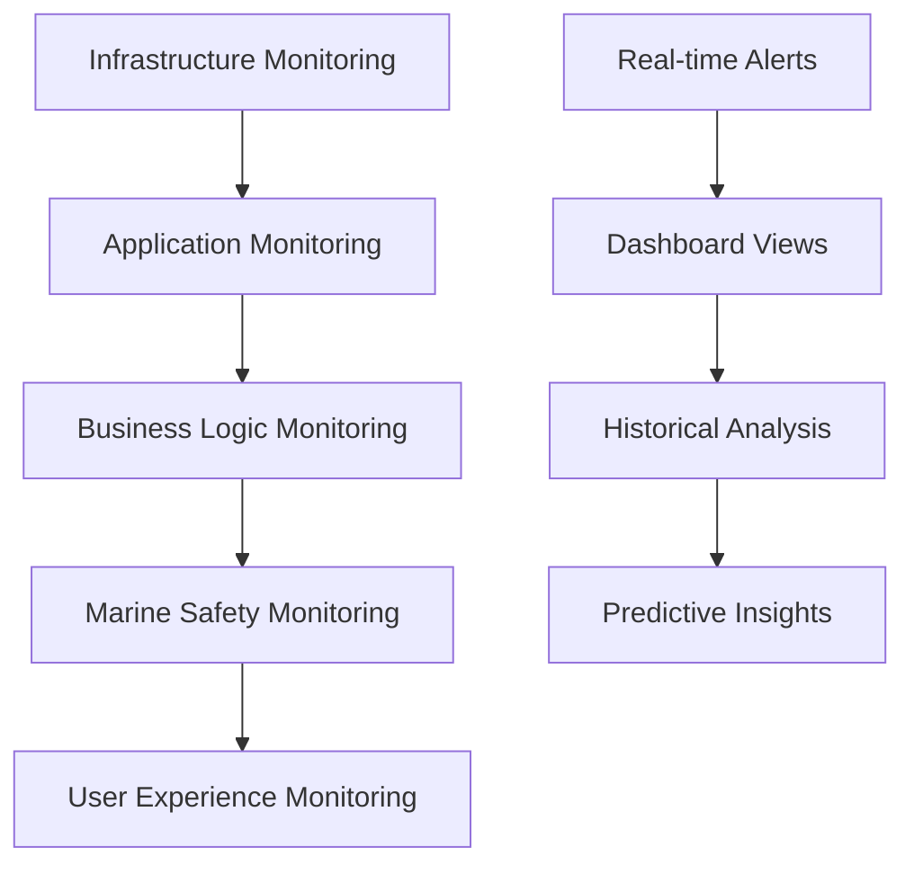

# Operations Monitoring & Alerting Guide

## Overview

This document provides comprehensive guidance for monitoring the Waves marine navigation platform. Given the safety-critical nature of marine navigation, our monitoring strategy emphasizes reliability, real-time alerting, and proactive issue detection.

## Monitoring Philosophy

### Core Principles

1. **Safety First**: Any system degradation that could impact navigation safety must trigger immediate alerts
2. **Proactive Detection**: Identify issues before they affect users
3. **Comprehensive Coverage**: Monitor all critical system components and data flows
4. **Actionable Alerts**: Every alert must include clear remediation steps
5. **Maritime Context**: Understand the unique requirements of marine operations

### Monitoring Levels



## Infrastructure Monitoring

### 1. AWS CloudWatch Integration

**Core Infrastructure Metrics:**

```yaml
# CloudWatch Dashboard Configuration
Dashboard: "Waves-Infrastructure-Overview"
Widgets:
  - EC2 Instances:
      CPUUtilization: 
        threshold: 80%
        period: 5 minutes
      MemoryUtilization:
        threshold: 85%
        period: 5 minutes
      NetworkIn/Out:
        threshold: 1GB/hour
        
  - RDS PostgreSQL:
      DatabaseConnections:
        threshold: 80% of max
      CPUUtilization:
        threshold: 75%
      FreeStorageSpace:
        threshold: 20% remaining
      ReadLatency/WriteLatency:
        threshold: 100ms
        
  - Lambda Functions:
      Duration:
        threshold: 25 seconds (for 30s timeout)
      Errors:
        threshold: 1% error rate
      Throttles:
        threshold: 0 (no throttling acceptable)
      
  - API Gateway:
      Count: Request volume
      Latency: 
        threshold: 2000ms
      4XXError/5XXError:
        threshold: 5% error rate
```

**Custom CloudWatch Metrics:**

```typescript
// Custom metrics for marine navigation
import { CloudWatch } from 'aws-sdk';

const cloudwatch = new CloudWatch();

class MarineMetrics {
  // Safety-critical metrics
  async recordDepthDataAccuracy(predicted: number, actual: number): Promise<void> {
    const accuracy = 1 - Math.abs(predicted - actual) / actual;
    
    await cloudwatch.putMetricData({
      Namespace: 'Waves/Marine/Safety',
      MetricData: [{
        MetricName: 'DepthPredictionAccuracy',
        Value: accuracy,
        Unit: 'Percent',
        Dimensions: [
          { Name: 'Environment', Value: process.env.NODE_ENV }
        ]
      }]
    }).promise();
  }
  
  // Navigation system performance
  async recordNavigationResponse(responseTimeMs: number): Promise<void> {
    await cloudwatch.putMetricData({
      Namespace: 'Waves/Navigation',
      MetricData: [{
        MetricName: 'NavigationResponseTime',
        Value: responseTimeMs,
        Unit: 'Milliseconds',
        Dimensions: [
          { Name: 'Service', Value: 'RouteCalculation' }
        ]
      }]
    }).promise();
  }
  
  // Safety alert metrics
  async recordSafetyAlert(alertType: string, severity: string): Promise<void> {
    await cloudwatch.putMetricData({
      Namespace: 'Waves/Safety/Alerts',
      MetricData: [{
        MetricName: 'AlertsGenerated',
        Value: 1,
        Unit: 'Count',
        Dimensions: [
          { Name: 'AlertType', Value: alertType },
          { Name: 'Severity', Value: severity }
        ]
      }]
    }).promise();
  }
}
```

### 2. Database Monitoring

**PostgreSQL + PostGIS Monitoring:**

```sql
-- Key database performance queries
-- Connection monitoring
SELECT count(*) as active_connections,
       max_conn,
       round(100 * count(*) / max_conn, 2) as pct_used
FROM pg_stat_activity,
     (SELECT setting::numeric as max_conn FROM pg_settings WHERE name = 'max_connections') mc;

-- Long running queries (potential issues)
SELECT pid,
       now() - pg_stat_activity.query_start AS duration,
       query,
       state
FROM pg_stat_activity
WHERE (now() - pg_stat_activity.query_start) > interval '5 minutes'
  AND state = 'active';

-- Spatial query performance monitoring
SELECT schemaname,
       tablename,
       attname,
       n_distinct,
       correlation
FROM pg_stats
WHERE tablename IN ('depth_readings', 'gps_tracks', 'marine_areas')
  AND attname LIKE '%location%';

-- TimescaleDB chunk health
SELECT hypertable_name,
       chunk_name,
       chunk_size,
       compress_chunk_size,
       range_start,
       range_end
FROM timescaledb_information.chunks
WHERE hypertable_name IN ('gps_tracks', 'depth_readings', 'weather_data')
ORDER BY range_start DESC
LIMIT 20;
```

**Database Alert Thresholds:**

```yaml
Database Alerts:
  Connection Pool:
    warning: >80% connections used
    critical: >95% connections used
    
  Query Performance:
    warning: >5 queries running >2 minutes
    critical: >10 queries running >5 minutes
    
  Storage:
    warning: <20% free space
    critical: <10% free space
    
  Replication Lag:
    warning: >30 seconds
    critical: >2 minutes
    
  PostGIS Operations:
    warning: Spatial index not used in >10% of queries
    critical: Spatial operations failing
```

### 3. Redis Monitoring

**Redis Performance Metrics:**

```bash
# Redis monitoring script
#!/bin/bash

# Memory usage
redis-cli INFO memory | grep used_memory_human

# Connection stats
redis-cli INFO clients | grep connected_clients

# Operations per second
redis-cli INFO stats | grep instantaneous_ops_per_sec

# Keyspace statistics
redis-cli INFO keyspace

# Slow log analysis
redis-cli SLOWLOG GET 10
```

## Application Monitoring

### 1. Application Performance Monitoring (APM)

**Node.js Application Monitoring:**

```typescript
// Performance monitoring middleware for Fastify
import { performance } from 'perf_hooks';

interface PerformanceMetrics {
  requestCount: number;
  averageResponseTime: number;
  errorRate: number;
  memoryUsage: NodeJS.MemoryUsage;
}

class ApplicationMonitor {
  private metrics: Map<string, PerformanceMetrics> = new Map();
  
  // Middleware for request monitoring
  async requestMonitoring(request: any, reply: any) {
    const startTime = performance.now();
    const endpoint = `${request.method} ${request.url}`;
    
    reply.raw.on('finish', () => {
      const duration = performance.now() - startTime;
      this.recordRequest(endpoint, duration, reply.statusCode);
    });
  }
  
  private recordRequest(endpoint: string, duration: number, statusCode: number) {
    const current = this.metrics.get(endpoint) || {
      requestCount: 0,
      averageResponseTime: 0,
      errorRate: 0,
      memoryUsage: process.memoryUsage()
    };
    
    current.requestCount++;
    current.averageResponseTime = 
      (current.averageResponseTime + duration) / 2;
    
    if (statusCode >= 400) {
      current.errorRate = (current.errorRate + 1) / current.requestCount;
    }
    
    this.metrics.set(endpoint, current);
    
    // Send to CloudWatch
    this.sendMetrics(endpoint, current);
  }
  
  private async sendMetrics(endpoint: string, metrics: PerformanceMetrics) {
    // Implementation for sending to CloudWatch/other monitoring systems
  }
}
```

### 2. Real-Time Safety Monitoring

**Safety System Health Checks:**

```typescript
class SafetySystemMonitor {
  private healthChecks = {
    depthDataValidation: this.checkDepthDataValidation,
    noaaApiConnectivity: this.checkNoaaApi,
    gpsAccuracy: this.checkGpsAccuracy,
    alertSystem: this.checkAlertSystem,
    emergencyContacts: this.checkEmergencyContacts
  };
  
  async performHealthCheck(): Promise<HealthCheckResult> {
    const results = await Promise.allSettled(
      Object.entries(this.healthChecks).map(async ([name, check]) => ({
        name,
        result: await check()
      }))
    );
    
    const criticalFailures = results.filter(
      result => result.status === 'rejected' || 
      (result.status === 'fulfilled' && !result.value.result.healthy)
    );
    
    if (criticalFailures.length > 0) {
      await this.triggerCriticalAlert(criticalFailures);
    }
    
    return {
      overall: criticalFailures.length === 0,
      details: results,
      timestamp: new Date().toISOString()
    };
  }
  
  private async checkDepthDataValidation(): Promise<HealthCheckItem> {
    try {
      // Test depth data validation pipeline
      const testReading = {
        latitude: 37.7749,
        longitude: -122.4194,
        depth: 10.5,
        confidence: 0.8
      };
      
      const validationResult = await validateDepthReading(testReading);
      
      return {
        healthy: validationResult.valid,
        responseTime: performance.now(),
        details: validationResult
      };
    } catch (error) {
      return {
        healthy: false,
        error: error.message,
        details: 'Depth validation system offline'
      };
    }
  }
  
  private async checkNoaaApi(): Promise<HealthCheckItem> {
    try {
      const response = await fetch(
        'https://api.tidesandcurrents.noaa.gov/api/prod/datagetter?' +
        'product=water_level&application=HealthCheck&format=json&' +
        'station=9414290&time_zone=gmt&datum=MLLW&' +
        'begin_date=20240101&end_date=20240101'
      );
      
      return {
        healthy: response.ok,
        responseTime: performance.now(),
        details: { status: response.status }
      };
    } catch (error) {
      return {
        healthy: false,
        error: error.message,
        details: 'NOAA API unreachable'
      };
    }
  }
  
  private async triggerCriticalAlert(failures: any[]): Promise<void> {
    // Send immediate alerts for safety system failures
    await Promise.all([
      this.sendSlackAlert(failures),
      this.sendPagerDutyAlert(failures),
      this.notifyOnCallEngineer(failures)
    ]);
  }
}
```

## Marine-Specific Monitoring

### 1. Navigation Data Quality

**Depth Data Quality Monitoring:**

```typescript
interface DataQualityMetrics {
  coverageScore: number;        // Geographic coverage
  accuracyScore: number;        // Prediction accuracy  
  freshnesssScore: number;      // Data recency
  confidenceScore: number;      // Average confidence
  contributorDiversity: number; // Unique contributors
}

class DepthDataQualityMonitor {
  async assessDataQuality(bounds: GeographicBounds): Promise<DataQualityMetrics> {
    const [coverage, accuracy, freshness, confidence, diversity] = await Promise.all([
      this.calculateCoverageScore(bounds),
      this.calculateAccuracyScore(bounds),
      this.calculateFreshnessScore(bounds),
      this.calculateConfidenceScore(bounds),
      this.calculateContributorDiversity(bounds)
    ]);
    
    const metrics = {
      coverageScore: coverage,
      accuracyScore: accuracy,
      freshnesssScore: freshness,
      confidenceScore: confidence,
      contributorDiversity: diversity
    };
    
    // Alert if any score drops below threshold
    await this.checkQualityThresholds(metrics);
    
    return metrics;
  }
  
  private async calculateCoverageScore(bounds: GeographicBounds): Promise<number> {
    // Calculate percentage of area with recent depth data
    const query = `
      SELECT ST_Area(ST_ConvexHull(ST_Collect(location))) / ST_Area($1::geometry) as coverage_ratio
      FROM depth_readings 
      WHERE ST_Within(location, $1::geometry)
        AND timestamp > NOW() - INTERVAL '30 days'
    `;
    
    const result = await db.query(query, [bounds.polygon]);
    return Math.min(1.0, result.rows[0].coverage_ratio);
  }
  
  private async checkQualityThresholds(metrics: DataQualityMetrics): Promise<void> {
    const thresholds = {
      coverage: 0.7,      // 70% coverage required
      accuracy: 0.8,      // 80% accuracy required
      freshness: 0.6,     // 60% data from last 30 days
      confidence: 0.7,    // 70% average confidence
      diversity: 0.5      // 50% contributor diversity
    };
    
    const failures = Object.entries(metrics).filter(
      ([key, value]) => value < thresholds[key as keyof typeof thresholds]
    );
    
    if (failures.length > 0) {
      await this.alertDataQualityIssue(failures);
    }
  }
}
```

### 2. Environmental Data Monitoring

**Weather Service Monitoring:**

```typescript
class WeatherServiceMonitor {
  private services = [
    { name: 'NOAA', endpoint: 'https://api.weather.gov', critical: true },
    { name: 'OpenWeather', endpoint: 'https://api.openweathermap.org', critical: false },
    { name: 'StormGlass', endpoint: 'https://api.stormglass.io', critical: false }
  ];
  
  async monitorWeatherServices(): Promise<ServiceHealthReport> {
    const results = await Promise.all(
      this.services.map(service => this.checkWeatherService(service))
    );
    
    const criticalFailures = results.filter(
      result => !result.healthy && result.service.critical
    );
    
    if (criticalFailures.length > 0) {
      await this.triggerWeatherServiceAlert(criticalFailures);
    }
    
    return {
      services: results,
      overallHealth: criticalFailures.length === 0,
      timestamp: new Date().toISOString()
    };
  }
  
  private async checkWeatherService(service: WeatherService): Promise<ServiceHealthResult> {
    const startTime = performance.now();
    
    try {
      const response = await fetch(`${service.endpoint}/health`, {
        timeout: 10000,
        headers: { 'User-Agent': 'Waves/1.0 Health Check' }
      });
      
      const responseTime = performance.now() - startTime;
      
      return {
        service,
        healthy: response.ok,
        responseTime,
        statusCode: response.status,
        details: await response.text()
      };
    } catch (error) {
      return {
        service,
        healthy: false,
        responseTime: performance.now() - startTime,
        error: error.message
      };
    }
  }
}
```

## Alert Configuration

### 1. Alert Severity Levels

```typescript
enum AlertSeverity {
  INFO = 'info',           // Informational, no action required
  WARNING = 'warning',     // Attention needed, monitor closely
  CRITICAL = 'critical',   // Immediate attention required
  EMERGENCY = 'emergency'  // Safety-critical, immediate response
}

interface AlertConfig {
  severity: AlertSeverity;
  channels: AlertChannel[];
  escalation: EscalationPolicy;
  autoResolution: boolean;
  documentation: string;
}

const alertConfigs: Record<string, AlertConfig> = {
  'depth-data-accuracy-drop': {
    severity: AlertSeverity.CRITICAL,
    channels: ['slack', 'email', 'pagerduty'],
    escalation: {
      timeoutMinutes: 15,
      escalateTo: ['on-call-marine-engineer', 'cto']
    },
    autoResolution: false,
    documentation: 'https://docs.waves.com/alerts/depth-accuracy'
  },
  
  'safety-system-offline': {
    severity: AlertSeverity.EMERGENCY,
    channels: ['slack', 'email', 'pagerduty', 'sms'],
    escalation: {
      timeoutMinutes: 5,
      escalateTo: ['on-call-engineer', 'marine-safety-officer', 'ceo']
    },
    autoResolution: false,
    documentation: 'https://docs.waves.com/alerts/safety-system'
  },
  
  'noaa-api-failure': {
    severity: AlertSeverity.WARNING,
    channels: ['slack', 'email'],
    escalation: {
      timeoutMinutes: 30,
      escalateTo: ['on-call-engineer']
    },
    autoResolution: true,
    documentation: 'https://docs.waves.com/alerts/noaa-api'
  }
};
```

### 2. Alert Channels Configuration

**Slack Integration:**

```typescript
class SlackAlerter {
  private webhookUrl = process.env.SLACK_WEBHOOK_URL;
  
  async sendAlert(alert: Alert): Promise<void> {
    const color = this.getSeverityColor(alert.severity);
    const emoji = this.getSeverityEmoji(alert.severity);
    
    const slackMessage = {
      channel: '#waves-alerts',
      username: 'Waves Monitoring',
      icon_emoji: ':ocean:',
      attachments: [{
        color,
        title: `${emoji} ${alert.title}`,
        text: alert.description,
        fields: [
          { title: 'Severity', value: alert.severity, short: true },
          { title: 'Component', value: alert.component, short: true },
          { title: 'Environment', value: process.env.NODE_ENV, short: true },
          { title: 'Time', value: alert.timestamp, short: true }
        ],
        actions: [{
          type: 'button',
          text: 'View Dashboard',
          url: `https://monitoring.waves.com/alerts/${alert.id}`
        }, {
          type: 'button',
          text: 'Runbook',
          url: alert.documentation
        }]
      }]
    };
    
    await fetch(this.webhookUrl, {
      method: 'POST',
      headers: { 'Content-Type': 'application/json' },
      body: JSON.stringify(slackMessage)
    });
  }
  
  private getSeverityColor(severity: AlertSeverity): string {
    const colors = {
      [AlertSeverity.INFO]: '#36a64f',
      [AlertSeverity.WARNING]: '#ff9500',
      [AlertSeverity.CRITICAL]: '#ff0000',
      [AlertSeverity.EMERGENCY]: '#8b0000'
    };
    return colors[severity];
  }
  
  private getSeverityEmoji(severity: AlertSeverity): string {
    const emojis = {
      [AlertSeverity.INFO]: 'ℹ️',
      [AlertSeverity.WARNING]: '⚠️',
      [AlertSeverity.CRITICAL]: '🚨',
      [AlertSeverity.EMERGENCY]: '🆘'
    };
    return emojis[severity];
  }
}
```

## Dashboard Configuration

### 1. Operational Dashboard

**Real-Time Operations View:**

```yaml
# Grafana Dashboard Config
Dashboard: "Waves Operations Overview"
Panels:
  - System Health:
      Type: Stat Panel
      Metrics:
        - Overall System Health
        - Active Incidents
        - Mean Time to Recovery
        
  - Traffic Overview:
      Type: Graph Panel
      Metrics:
        - API Requests/minute
        - Mobile App Sessions
        - WebSocket Connections
        
  - Marine Safety:
      Type: Stat Panel
      Metrics:
        - Safety Alerts Generated
        - Depth Data Accuracy
        - Navigation System Uptime
        
  - Infrastructure:
      Type: Graph Panel
      Metrics:
        - EC2 CPU/Memory
        - RDS Connections
        - Lambda Invocations
        
  - Data Quality:
      Type: Gauge Panel
      Metrics:
        - Depth Data Coverage
        - Weather Data Freshness
        - User Contribution Rate
```

### 2. Marine Safety Dashboard

**Safety-Specific Monitoring:**

```typescript
// Marine safety dashboard metrics
const safetyDashboardMetrics = {
  realTime: {
    activeNavigators: 'Current users navigating',
    safetyAlertsActive: 'Active safety alerts',
    emergencyIncidents: 'Emergency incidents in progress',
    systemHealthScore: 'Overall safety system health'
  },
  
  dataQuality: {
    depthDataAccuracy: 'Accuracy vs official charts',
    weatherDataFreshness: 'Age of weather data',
    coverageScore: 'Geographic data coverage',
    userContributionRate: 'New data submissions/hour'
  },
  
  performance: {
    alertResponseTime: 'Time from detection to alert',
    navigationLatency: 'Route calculation latency',
    offlineCapability: 'Offline feature availability',
    batteryOptimization: 'Mobile battery efficiency'
  },
  
  compliance: {
    regulatoryCompliance: 'Maritime regulation compliance',
    dataRetentionCompliance: 'Data retention policy adherence',
    privacyCompliance: 'Privacy regulation compliance',
    emergencyProtocolCompliance: 'Emergency procedure compliance'
  }
};
```

## Incident Response

### 1. Incident Classification

```typescript
enum IncidentType {
  SAFETY_CRITICAL = 'safety_critical',    // Affects navigation safety
  SERVICE_DEGRADATION = 'service_degradation', // Performance impact
  DATA_QUALITY = 'data_quality',          // Data accuracy issues
  SECURITY = 'security',                  // Security incidents
  INFRASTRUCTURE = 'infrastructure'       // Infrastructure issues
}

interface IncidentResponse {
  type: IncidentType;
  severity: AlertSeverity;
  responseTeam: string[];
  maxResponseTime: number; // minutes
  escalationPolicy: EscalationPolicy;
  communicationPlan: CommunicationPlan;
}

const incidentResponses: Record<IncidentType, IncidentResponse> = {
  [IncidentType.SAFETY_CRITICAL]: {
    type: IncidentType.SAFETY_CRITICAL,
    severity: AlertSeverity.EMERGENCY,
    responseTeam: ['marine-safety-officer', 'on-call-engineer', 'cto'],
    maxResponseTime: 5,
    escalationPolicy: {
      timeoutMinutes: 5,
      escalateTo: ['ceo', 'coast-guard-liaison']
    },
    communicationPlan: {
      channels: ['slack', 'email', 'sms', 'phone'],
      publicCommunication: true,
      regulatoryNotification: true
    }
  }
};
```

### 2. Runbook Integration

**Automated Runbook Execution:**

```typescript
class RunbookEngine {
  private runbooks = new Map<string, Runbook>();
  
  async executeRunbook(alertType: string, context: AlertContext): Promise<RunbookResult> {
    const runbook = this.runbooks.get(alertType);
    if (!runbook) {
      throw new Error(`No runbook found for alert type: ${alertType}`);
    }
    
    const steps = runbook.steps;
    const results: StepResult[] = [];
    
    for (const step of steps) {
      try {
        const result = await this.executeStep(step, context);
        results.push(result);
        
        if (result.stopExecution) {
          break;
        }
      } catch (error) {
        results.push({
          step: step.name,
          success: false,
          error: error.message,
          stopExecution: true
        });
        break;
      }
    }
    
    return {
      runbook: runbook.name,
      results,
      success: results.every(r => r.success),
      executionTime: Date.now() - context.startTime
    };
  }
  
  private async executeStep(step: RunbookStep, context: AlertContext): Promise<StepResult> {
    switch (step.type) {
      case 'health_check':
        return await this.performHealthCheck(step.config);
      
      case 'restart_service':
        return await this.restartService(step.config.serviceName);
      
      case 'scale_resources':
        return await this.scaleResources(step.config);
      
      case 'failover':
        return await this.performFailover(step.config);
      
      case 'notify':
        return await this.sendNotification(step.config, context);
      
      default:
        throw new Error(`Unknown step type: ${step.type}`);
    }
  }
}
```

## Performance Monitoring

### 1. Key Performance Indicators (KPIs)

**Marine Navigation KPIs:**

```typescript
interface MarineNavigationKPIs {
  // Safety KPIs
  safetyAlertAccuracy: number;      // % of alerts that were valid
  incidentPreventionRate: number;   // # of incidents prevented
  emergencyResponseTime: number;    // Average response time in seconds
  
  // Navigation KPIs
  routeCalculationLatency: number;  // Average route calc time (ms)
  depthDataAccuracy: number;        // Accuracy vs ground truth (%)
  gpsTrackingPrecision: number;     // GPS accuracy in meters
  
  // System KPIs
  systemUptime: number;             // System availability (%)
  apiResponseTime: number;          // Average API response time (ms)
  mobileAppPerformance: number;     // App performance score
  
  // User Experience KPIs
  userSatisfactionScore: number;    // User rating (1-5)
  featureAdoptionRate: number;      // % users using key features
  dataContributionRate: number;     // Depth readings per user per trip
}
```

### 2. Performance Baselines

**Establishing Performance Baselines:**

```sql
-- Performance baseline queries
-- API response time baseline
SELECT 
  DATE_TRUNC('hour', timestamp) as hour,
  endpoint,
  PERCENTILE_CONT(0.50) WITHIN GROUP (ORDER BY response_time_ms) as p50,
  PERCENTILE_CONT(0.95) WITHIN GROUP (ORDER BY response_time_ms) as p95,
  PERCENTILE_CONT(0.99) WITHIN GROUP (ORDER BY response_time_ms) as p99
FROM api_performance_logs
WHERE timestamp >= NOW() - INTERVAL '30 days'
GROUP BY hour, endpoint
ORDER BY hour DESC;

-- Depth data accuracy baseline
SELECT 
  DATE_TRUNC('day', timestamp) as day,
  AVG(confidence_score) as avg_confidence,
  COUNT(*) as reading_count,
  COUNT(DISTINCT user_id) as contributor_count
FROM depth_readings
WHERE timestamp >= NOW() - INTERVAL '90 days'
  AND confidence_score > 0.5
GROUP BY day
ORDER BY day DESC;

-- Navigation system performance
SELECT 
  DATE_TRUNC('hour', timestamp) as hour,
  AVG(calculation_time_ms) as avg_calc_time,
  MAX(calculation_time_ms) as max_calc_time,
  COUNT(*) as route_calculations
FROM navigation_performance_logs
WHERE timestamp >= NOW() - INTERVAL '7 days'
GROUP BY hour
ORDER BY hour DESC;
```

This comprehensive monitoring strategy ensures that the Waves marine navigation platform maintains the highest levels of reliability and safety while providing actionable insights for continuous improvement.